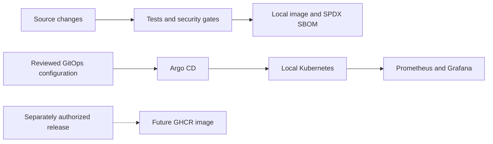

# Secure GitOps Portfolio Platform

[](https://github.com/kelechiP/secure-gitops-platform-portfolio/actions/workflows/ci.yml)

A DevOps and DevSecOps reference platform combining a minimal Python service, hardened containers, Kubernetes delivery with Helm and Argo CD, observability, and a static AWS/EKS Terraform blueprint.

## Architecture



## Engineering focus

- Dependency-free HTTP API with health, readiness, and Prometheus metrics endpoints.
- Non-root Distroless runtime pinned by immutable digest.
- Helm security defaults: read-only root filesystem, dropped capabilities, seccomp, resource bounds, and no service-account token mount.
- Argo CD HTTPS manifests with limited AppProjects, pruning, and self-healing configuration.
- Prometheus discovery, a Grafana dashboard, and a target-availability alert rule.
- Read-only CI for tests, Helm, Terraform, secret detection, vulnerability scanning, and SPDX SBOM generation.
- Full commit-SHA pins for GitHub Actions, release concurrency protection, and a fail-closed version-tag guard.
- Validated static Terraform blueprint for private EKS workers, encrypted storage, restricted endpoints, KMS, and control-plane logging. AWS/EKS has not been deployed.

## Run the application

```powershell
python -m unittest discover -s app/tests -v
python app/src/server.py
```

The service listens on port 8080. Endpoints are `/`, `/healthz`, `/readyz`, and `/metrics`.

For a local container:

```powershell
docker build -t secure-gitops-platform-portfolio:local ./app
docker run --rm -p 127.0.0.1:8080:8080 --read-only --tmpfs /tmp:rw,noexec,nosuid,size=16m --security-opt no-new-privileges secure-gitops-platform-portfolio:local
```

## Validate the platform

```powershell
python -m unittest discover -s scripts/tests -v
python scripts/validate_action_pins.py
helm lint helm/platform-api
helm template platform-api helm/platform-api --namespace secure-platform
terraform -chdir=infra/terraform/aws init -backend=false -input=false
terraform -chdir=infra/terraform/aws validate
```

See [local validation](docs/local-validation.md), [architecture](docs/architecture.md), and the [Terraform blueprint](infra/terraform/aws/README.md) for scope and further checks.

## GitOps and observability

The Applications target `https://github.com/kelechiP/secure-gitops-platform-portfolio.git`. This sanitized portfolio repository is public and anonymous HTTPS access is available without a repository credential. Live reconciliation remains unvalidated and requires separate authorization. No Kubernetes deployment was performed to initialize this repository.

The local workflow uses a locally built image loaded into kind. The Helm registry default points to the future portfolio image and cannot be pulled yet. See the [GitOps guide](docs/argocd-validation.md) and [observability guide](docs/observability.md) for future validation procedures.

## Release status

No release tag, published release, GHCR package, or published portfolio image exists yet. The repository has protected `main` and protected `v*` release tags. The future image repository is `ghcr.io/kelechip/secure-gitops-platform-portfolio`. Provenance, SBOM attestation, signing, and signature verification remain unvalidated. SPDX generation in CI does not establish these guarantees.

A first release requires separate authorization. The release guard permits first-package bootstrap only after successful token acquisition and an authenticated HTTP 404 with canonical `NAME_UNKNOWN` from GHCR tag enumeration. Other uncertain states fail closed. Public visibility enables artifact-attestation eligibility on the applicable GitHub plan, but does not guarantee successful attestation or signing. See [supply-chain security](docs/supply-chain-security.md).

## Scope and limitations

Local tests and static checks validate the source, templates, and container. Live GitOps reconciliation, monitoring, HPA scaling, and NetworkPolicy enforcement have not been validated from this repository. HPA needs Metrics Server; NetworkPolicy needs a compatible CNI. AWS remains a non-deployed static blueprint. Admission policy, SLOs, and progressive delivery are on the [roadmap](docs/roadmap.md).

## Repository layout

| Directory | Purpose |
|---|---|
| `app/` | API, tests, and Dockerfile |
| `helm/platform-api/` | Workload and monitoring templates |
| `gitops/clusters/local/` | Argo CD projects and applications |
| `observability/` | Monitoring values and dashboard |
| `infra/terraform/aws/` | Static AWS/EKS blueprint |
| `scripts/` | Validation and local workflow helpers |
| `.github/workflows/` | CI and separately authorized release workflow |

Licensed under the [MIT License](LICENSE).
