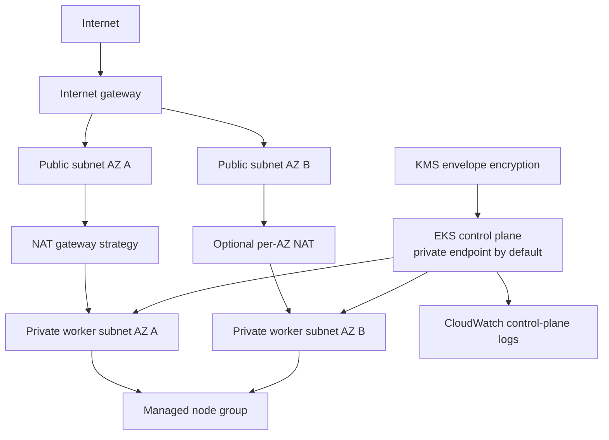

# Secure AWS EKS Terraform foundation

This directory is a reusable, production-shaped AWS blueprint. It has not been planned against an AWS account or applied. It creates nothing until an authorized operator supplies account-specific inputs and deliberately runs Terraform under separate deployment authorization.

## Architecture



- Public subnets do not assign public IPs automatically. They contain the internet-facing route and NAT gateways only; future controlled ingress resources can use them after separate review.
- Managed worker nodes run only in private subnets. They have no direct public addressing or SSH configuration. An EC2 launch template explicitly creates each root EBS volume as encrypted `gp3`, preserves the configured size, and deletes it with the instance.
- The node launch template requires IMDSv2 tokens and uses a metadata hop limit of 2 so containerized Kubernetes workloads can use authorized instance metadata flows. It does not select an AMI, instance type, SSH key, public IP, or custom security group.
- The EKS endpoint enables private access and disables public access by default. Enabling public access also requires at least one valid restricted CIDR and rejects `0.0.0.0/0`.
- `single` NAT is the development default: lower fixed cost, but cross-AZ traffic and a single point of egress failure. `one_per_az` improves resilience and avoids cross-AZ NAT routing at higher fixed cost. `none` requires separately designed VPC endpoints or other private egress before nodes can join and pull images.
- Kubernetes secrets use a rotating customer-managed KMS key. All five EKS control-plane log types are enabled with explicit retention.
- Cluster bootstrap administrator permissions are disabled. An optional reviewed IAM principal can receive the AWS-managed EKS cluster-admin access policy through an EKS access entry.
- IAM roles attach only the AWS-managed policies required by the EKS control plane and managed nodes. No inline wildcard application policy or CI deployment role is included.

## Files

| File | Purpose |
|---|---|
| `versions.tf`, `.terraform.lock.hcl` | Terraform/provider constraints and checksums |
| `providers.tf`, `locals.tf` | Region, default tags, consistent names, derived counts |
| `variables.tf` | Validated network, endpoint, node, and administration inputs |
| `networking.tf` | VPC, two-or-more AZs, subnets, routes, IGW, configurable NAT |
| `security.tf` | Restricted control-plane security group, KMS, log retention |
| `eks.tf` | IAM roles, EKS cluster, optional access entry, secured node launch template, managed node group |
| `outputs.tf` | VPC, subnet, cluster, node group, KMS, and NAT identifiers |
| `terraform.tfvars.example` | Conservative non-secret development example |
| `environments/dev/backend.hcl.example` | Placeholder-only remote backend example |

## Inputs and outputs

Important inputs include region/AZs and non-overlapping CIDRs, NAT strategy, Kubernetes version, endpoint mode and restricted CIDRs, optional administrator principal ARN, node capacity/instance/scaling settings, log retention, and tags. Terraform validations and resource preconditions require at least two unique AZs, aligned subnet lists, restricted public endpoint CIDRs, and consistent node scaling bounds.

Outputs expose the VPC and subnet IDs, cluster name/endpoint, sensitive cluster CA data, node group name, KMS key ARN, and NAT gateway IDs. Outputs are infrastructure metadata, not kubeconfig or credentials.

## Remote state design

The root contains an empty S3 backend declaration so CI can run `terraform init -backend=false`. A future, separately reviewed bootstrap should create:

- one dedicated S3 state bucket with versioning, bucket-owner enforcement, all public-access blocks, TLS-only policy, and SSE-KMS encryption;
- a dedicated KMS key with rotation and narrowly scoped administration/use policies;
- a DynamoDB lock table with a string `LockID` partition key, encryption, point-in-time recovery, and deletion protection where appropriate;
- distinct state keys such as `secure-gitops-platform-portfolio/dev/aws.tfstate` for each environment;
- least-privilege operator/CI roles limited to the environment key prefix, lock item operations, and required KMS use.

The bucket, table, and keys are intentionally not created here because Terraform cannot safely store its own initial backend state in a backend that does not yet exist. Copy `environments/dev/backend.hcl.example` outside tracked paths, replace placeholders, then initialize with `-backend-config` only after authorization. Never commit the completed backend file.

## Validation without AWS credentials

These commands format and statically validate configuration. They do not plan or deploy:

```powershell
terraform fmt -check -recursive infra/terraform/aws
terraform -chdir=infra/terraform/aws init -backend=false -input=false
terraform -chdir=infra/terraform/aws validate
tflint --chdir=infra/terraform/aws --init
tflint --chdir=infra/terraform/aws --format compact
trivy config --severity HIGH,CRITICAL --exit-code 1 infra/terraform/aws
```

CI runs the same controls without AWS credentials. It never runs `terraform plan` or `terraform apply`.

## Future Argo CD connection

Argo CD installation into EKS is deferred. A future design must first provide reviewed administrator access, network reachability to the private API endpoint (for example through a VPN, transit network, or in-VPC runner), workload identity, namespace/RBAC boundaries, anonymous HTTPS access to this public repository (no repository credential required), and a digest-pinned environment Application. This foundation grants GitHub and the current local Argo CD installation no AWS or EKS access.

## Cost warning

Do not deploy this blueprint casually. Approximate US-region cost drivers, before discounts and workload traffic, include:

- EKS standard-support control plane: `$0.10/hour`, approximately `$73/month`; extended support is materially higher ([AWS EKS pricing](https://aws.amazon.com/eks/pricing/)).
- NAT gateway: the AWS US East example is `$0.045/hour` plus `$0.045/GB` processed. One NAT plus one public IPv4 is roughly `$36.50/month` before traffic; per-AZ NAT roughly doubles the fixed two-AZ amount ([AWS VPC pricing](https://aws.amazon.com/vpc/pricing/)).
- Public IPv4: `$0.005/hour` for each in-use or idle address ([AWS VPC pricing](https://aws.amazon.com/vpc/pricing/)).
- EC2 managed nodes, EBS root volumes, CloudWatch ingestion/retention, KMS requests/key storage, cross-AZ traffic, NAT processing, and internet data transfer vary with region and usage.

Use the AWS Pricing Calculator with the target region and current rates before any authorization. Spot capacity lowers node cost but can be interrupted.

## Future authorized deployment and teardown

Deployment is deliberately under separate deployment authorization. Before any future plan/apply, create and secure remote state, review current EKS/Kubernetes support, supply a specific administrator principal, validate CIDRs and quotas, estimate cost, obtain approval, and save a reviewed plan.

For teardown, first remove Kubernetes services that own AWS load balancers or volumes, verify retained data, then run an approved `terraform destroy` using the same state and inputs. Confirm EKS, node groups, NAT gateways/EIPs, log groups, KMS scheduled deletion, and VPC resources are gone. State-bucket/table teardown is a separate last step after state retention requirements are satisfied. Never delete state first.

## Known limitations and deferred work

- No AWS plan, apply, API validation, or runtime test has been performed.
- Account-level prerequisites, quotas, Organizations policies, and exact EKS version/add-on compatibility remain unverified.
- A single NAT is not highly available; `none` lacks the VPC endpoints needed for functional private nodes.
- EKS add-ons, IRSA/Pod Identity, autoscaling, ingress, DNS, TLS, WAF, databases, backups, policy controllers, and Argo CD installation are deferred.
- GitHub OIDC federation and AWS deployment roles are explicitly excluded.
- The optional cluster-admin access entry is broad and must name a tightly controlled break-glass/platform role in a real environment.
- Remote-state infrastructure and its access policies are documented but not implemented.
